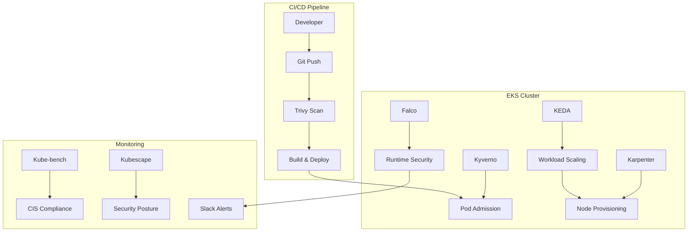

# Kubernetes Security & Auto-scaling on EKS

Complete production-ready setup for secure, auto-scaling Kubernetes workloads on Amazon EKS with comprehensive security controls and event-driven scaling.

## 🏗️ Architecture Overview



## 📋 Components

### Security Layer
- **Trivy**: Container image and IaC vulnerability scanning
- **Kyverno**: Policy-as-code admission controller
- **Falco**: Runtime threat detection with Slack integration
- **Kube-bench**: CIS Kubernetes benchmark compliance
- **Kubescape**: NIST/MITRE security posture assessment

### Auto-scaling Layer
- **KEDA**: Event-driven horizontal pod autoscaling (SQS-based)
- **Karpenter**: Just-in-time node provisioning with spot instances

## 🚀 Quick Start

### Prerequisites

```bash
# Required tools
aws --version        # AWS CLI v2
kubectl version      # Kubernetes CLI
terraform --version  # Terraform >= 1.0
helm version         # Helm v3
python3 --version    # Python 3 (for YAML validation)

# EKS cluster with OIDC provider
aws eks describe-cluster --name <cluster-name> --query cluster.identity.oidc.issuer

# Verify Helm repositories
helm repo add falcosecurity https://falcosecurity.github.io/charts
helm repo add kedacore https://kedacore.github.io/charts
helm repo update
```

### 1. Deploy Security Infrastructure

```bash
cd security
kubectl apply -f rbac.yaml
kubectl apply -f kyverno.yaml

# Install Falco with Slack integration
helm repo add falcosecurity https://falcosecurity.github.io/charts
helm install falco falcosecurity/falco -n security -f falco-values.yaml

# Schedule compliance scans
kubectl apply -f kube-bench.yaml
kubectl apply -f kubescape.yaml
```

### 2. Deploy Auto-scaling Infrastructure

```bash
cd ../autoscaling/terraform

# Validate configuration first
terraform fmt
terraform validate

# Configure variables
export TF_VAR_aws_region="eu-central-1"
export TF_VAR_cluster_name="my-eks-cluster"

# Plan and deploy
terraform init
terraform plan
terraform apply
```

### 3. Apply Scaling Manifests

```bash
cd ../manifests

# Validate YAML syntax first
python3 -c "import yaml; [yaml.safe_load_all(open(f)) for f in ['karpenter-ec2nodeclass.yaml', 'karpenter-nodepool.yaml', 'keda-scaledobject-sqs.yaml']]"

# Apply in order (dependencies matter)
kubectl apply -f karpenter-ec2nodeclass.yaml
kubectl apply -f karpenter-nodepool.yaml
kubectl apply -f keda-scaledobject-sqs.yaml
```

## 🔧 Configuration Details

### Karpenter Node Provisioning

**EC2NodeClass** (`workers-spot`):
- **AMI**: Amazon Linux 2
- **Instance types**: c5/c6i, m5/m6i (generation > 5)
- **Capacity**: Spot instances with 72h expiry
- **Networking**: Auto-discovery via `karpenter: "true"` tags

**NodePool** specifications:
```yaml
limits:
  cpu: 1000                    # Max 1000 vCPUs
taints:
  - key: spot
    effect: NoSchedule          # Isolate spot workloads
disruption:
  consolidationPolicy: WhenUnderutilized
  expireAfter: 72h             # Force refresh every 3 days
```

### KEDA Event-driven Scaling

**ScaledObject** (`orders-consumer`):
- **Trigger**: AWS SQS queue depth
- **Scaling range**: 0-200 replicas
- **Threshold**: 100 messages per replica
- **Cooldown**: 60 seconds between scale events

```yaml
triggers:
  - type: aws-sqs-queue
    metadata:
      queueURL: https://sqs.eu-central-1.amazonaws.com/123456789012/orders  # Update with real queue URL
      queueLength: "100"
      awsRegion: eu-central-1
```

**⚠️ Configuration Update Required**: Replace the example SQS queue URL with your actual queue URL before deployment.

### Security Policies

**Kyverno admission rules**:
- ❌ Privileged containers blocked
- ✅ Non-root execution required
- ❌ `:latest` image tags disallowed
- ✅ Resource requests/limits mandatory

**Falco runtime detection**:
- Suspicious syscalls → Slack alerts
- Container escapes → Immediate notification
- Privilege escalation → Security team alert

## 📊 Monitoring & Verification

### Real-time Monitoring

```bash
# Watch node auto-provisioning
kubectl get nodes -l karpenter.sh/nodepool=workers-spot -w

# Monitor workload scaling
kubectl get pods -l app=orders-consumer -w

# Check SQS queue depth
aws sqs get-queue-attributes \
  --queue-url https://sqs.eu-central-1.amazonaws.com/123456789012/orders \
  --attribute-names ApproximateNumberOfMessages
```

### Security Validation

```bash
# Check policy violations
kubectl get events --field-selector reason=PolicyViolation

# View Falco alerts
kubectl logs -n security -l app.kubernetes.io/name=falco -f

# Compliance scan results
kubectl logs -n security -l app=kube-bench
kubectl logs -n security -l app=kubescape
```

### Scaling Metrics

```bash
# KEDA scaling status
kubectl get scaledobject -A
kubectl describe scaledobject orders-consumer

# Karpenter provisioning
kubectl get nodepool -n karpenter
kubectl describe nodepool workers-spot
```

## 🔐 Security Best Practices

### CI/CD Integration

Add to `.github/workflows/security.yml`:
```yaml
- name: Trivy vulnerability scan
  uses: aquasecurity/trivy-action@master
  with:
    scan-type: config
    severity: CRITICAL,HIGH
```

### Runtime Security

**Falco configuration notes**:
- Update Slack webhook URL in `security/falco-values.yaml`
- Service account `security-tools` must exist before installation

**Falco rules** detect:
- Shell spawned in container
- Sensitive file access
- Network connections from containers
- Privilege escalation attempts

### Compliance Automation

**Scheduled scans**:
- Kube-bench: Daily CIS compliance check
- Kubescape: NIST/MITRE posture assessment
- Results exported to JSON for SIEM integration

## 🛠️ Troubleshooting

### Configuration Validation

**Before deployment, validate all configurations**:
```bash
# Terraform validation
cd autoscaling/terraform
terraform fmt -check
terraform validate

# YAML syntax validation
python3 -c "
import yaml, os
for root, dirs, files in os.walk('.'):
    for file in files:
        if file.endswith(('.yaml', '.yml')):
            with open(os.path.join(root, file)) as f:
                yaml.safe_load_all(f)
print('All YAML valid')
"

# Helm chart verification
helm show chart oci://public.ecr.aws/karpenter/karpenter --version 1.1.0
helm search repo kedacore/keda --version 2.17.2
```

### Common Issues

**Terraform Provider Issues**:
```bash
# If Helm provider fails, ensure using v3.0+ syntax
# providers.tf should use: kubernetes = { config_path = "~/.kube/config" }
# NOT: kubernetes { config_path = "~/.kube/config" }

# Re-initialize if provider issues
terraform init -upgrade
```

**Karpenter nodes not provisioning**:
```bash
# Check IAM permissions
kubectl logs -n karpenter -l app.kubernetes.io/name=karpenter

# Verify subnet/SG tags
aws ec2 describe-subnets --filters "Name=tag:karpenter,Values=true"

# Ensure role exists
aws iam get-role --role-name karpenter-node-role
```

**KEDA not scaling**:
```bash
# Check SQS permissions
kubectl logs -n keda -l app.kubernetes.io/name=keda-operator

# Verify queue URL and region (update placeholder values)
kubectl describe scaledobject orders-consumer

# Test queue access
aws sqs get-queue-attributes --queue-url <your-actual-queue-url> --attribute-names ApproximateNumberOfMessages
```

**Security policy blocks**:
```bash
# Check Kyverno policy reports
kubectl get policyreport -A

# Review admission controller logs
kubectl logs -n kyverno -l app.kubernetes.io/name=kyverno

# Test policy with dry-run
kubectl apply --dry-run=server -f <your-manifest>
```

## 📚 Additional Resources

- [Karpenter Best Practices](https://karpenter.sh/docs/concepts/)
- [KEDA Scalers Documentation](https://keda.sh/docs/scalers/)
- [Falco Rules Reference](https://falco.org/docs/rules/)
- [Kyverno Policy Library](https://kyverno.io/policies/)

## 🏷️ Tags & Labels

All resources use consistent labeling:
```yaml
labels:
  app.kubernetes.io/name: <component>
  app.kubernetes.io/version: <version>
  environment: production
  team: platform
```

## ✅ Configuration Versions

**Tested with:**
- Terraform: >= 1.0
- Helm: v3.0+
- Karpenter: v1.1.0 (OCI registry)
- KEDA: v2.17.2
- Falco: v6.2.5
- Kyverno: Latest (via manifest)

**Important Notes:**
- Helm provider v3.0+ requires object syntax: `kubernetes = {}` not `kubernetes {}`
- Karpenter uses v1 API (not v1beta1)
- All configurations validated for syntax and compatibility

## 📄 License

MIT License - see [LICENSE](LICENSE) file for details.